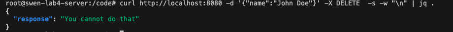

# SWEN 2003 Lab

## Run
`python server.py`

## Instructions
1. Add a log  message to server to indicate that the server is running. See python [print()](https://docs.python.org/3/library/functions.html#print) function.

2. The `do_GET` method is called when a `GET` request is received by the server. The server will return the file [index.html](public/index.html) in  the public folder. Modify the html file to match the below image.

_add the attribute `id='name'` to the input field_

_add the attribute `id='send'` to the button_

3. The `do_POST` method is called when a `POST` request is received by the server. When a request is  sent with a json object contain a  name `{ "name" : "My  Name"}`, the server will return a json object containing a response key with a greeting and the name. Add a date field to the response. See python  [datetime](https://docs.python.org/3/library/datetime.html#:~:text=More%20examples%20of%20working%20with%20date%3A) object.

4. The server currently returns a 501 error when a `DELETE` request is received. We want to explicitly restrict method and inform the user that it is forbidden. Implement the `do_DELETE` file in the `server.py` file, return the appropriate HTTP response code and a response as shown below.

The final page should populate the below when a user sends their name.

5. __BONUS__ Make the page look good.  
## Submission
1. Create a branch with you student number, using the `git checkout -b ` command.
2. When all changes are done, add the the changes `git add`.
3. Commit the changes to the local repository`git commit`. Add the appropriate message.
4. Push changes to re remote reposition using `git push`.

N.B. use `git <command> --help` for information as needed.